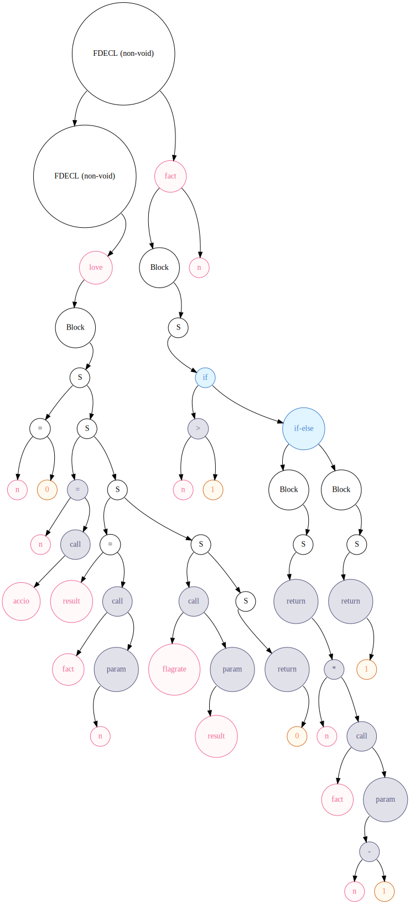
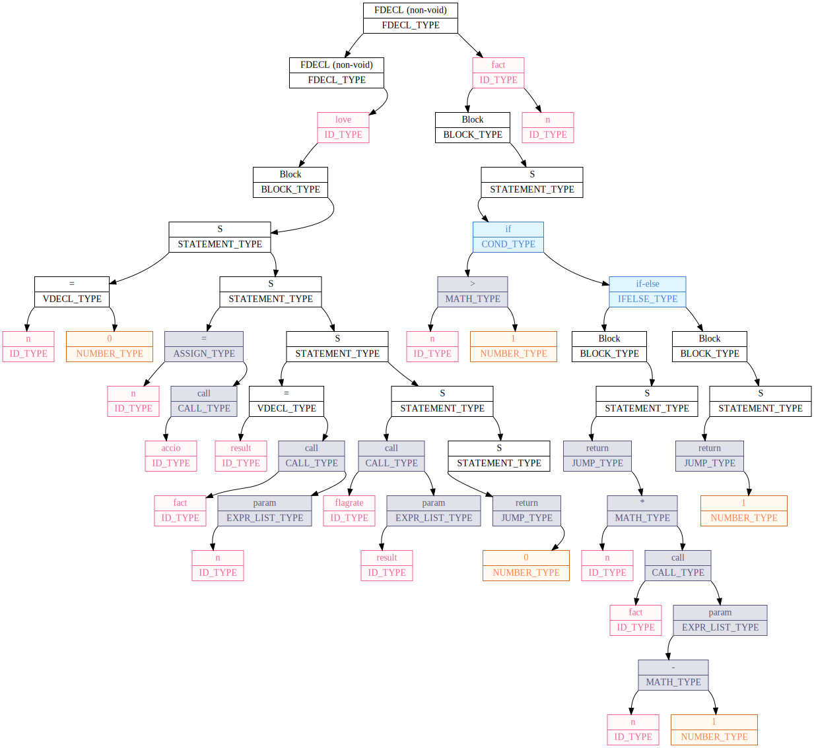

# Potter Tongue for x86-64
> Simple Harry Potter influenced programming language.

This is an x86-64 compiler set for my [potter-tongue](https://github.com/tralf-strues/potter-tongue) programming language, which was originally written for my [software cpu emulator](https://github.com/tralf-strues/software-cpu).

## Contents
- **[Installation](#installation)**
- **[Usage](#usage)**
  - [Nasm file generation](#1-nasm-file-generation)
  - [Tokens dump](#2-tokens-dump)
  - [Tree graph dumps](#3-tree-graph-dumps)
  - [Tree text dump](#4-tree-text-dump)
  - [Symbol table dump](#5-symbol-table-dump)
  - [Using numbers](#6-using-numbers-and-the-magic-goes-away)
- **[New language features](#new-language-features)**
  - [1. Switch from float to integer](#1-switch-from-float-to-integer-abacus)
    - [Arithmetic operations and sqrt](#arithmetic-operations-and-sqrt)
    - [Input and output](#input-and-output)
  - [2. Constant strings](#2-constant-strings-scroll)
    - [Declaring global strings](#a-declaring-global-strings)
    - [Passing strings to flagrate](#b-passing-strings-to-flagrate)
    - [Writing new-line character](#c-writing-new-line-character)
  - [3. Arrays](#3-arrays-link)
  - [4. Void functions](#4-void-functions-waning_crescent_moon)
  - [New grammar :pencil:](#new-potter-tongue-grammar-pencil)
- **[Performance](#performance)**
  - [Comparison with SCPU](#comparison-with-scpu)
  - [Optimization](#optimization)
    - [Two-operand operations](#two-operand-operations)
    - [Conditions](#conditions)
    - [Optimization conclusion](#optimization-conclusion)

## Installation
In order to install the compiler, you first have to install my [file-manager](https://github.com/tralf-strues/file-manager) library. Then do the following:
```Shell
$ git clone https://github.com/tralf-strues/potter-tongue-x86.git
$ make init
$ make
``` 

## Usage
There are many things this potter-tongue compiler can do. To get the idea of what flags it supports, just look at the help message
```
$ ./compiler.out -h
Simple Harry Potter influenced programming language set.
-S
        Write nasm listing of the program to the specified file.

-fdump-tokens
        Print parsed tokens in the following format:
        Token <token_number>:
                type = <type>[<type_number>]
                data = (<data-type>) <data>
                <line>|...<token>...
                          ^
        Here's a concrete example:
        Token 0:
                type = KEYWORD_TOKEN_TYPE[1]
                data = (keywordCode) PROG_START_KEYWORD[0] Godric's-Hollow
                1|Godric's-Hollow Hogwarts
                  ^

-fdump-tree-graph-simple
        Write simple graph dump in .svg format.

-fdump-tree-graph-detailed
        Write detailed graph dump in .svg format.

-open-tree-graph
        When written the graph dump, open it with the default program for viewing .svg format.

-fdump-tree
        Writes the syntax tree to file.

-fdump-symtab
        Prints the symbol table in the following format:

        ================ Symbol table ================
        functionsCount = <total number of functions>
        functions = { 
                { name='<>', varsCount=<>, paramsCount=<>, 
                  vars=['<>', ...] },
                ...
        }

        stringsCount = <total number of strings>
        strings = {
                { name='<>', content='<>'},
                ...
        }

-numeric
        Allow using numbers (e.g. '3' instead of 'tria', or '22').

-h
        Print this message.

-o
        Specify the output file.
```

Let's look at some of the options in more detail.
#### 1. NASM file generation
The compiler can generate NASM listring of the program being compiled. You just have to use the flag `-S` (*well, hello, gcc*) and specify the output file name after it.
```Shell
$ ./compiler.out program.txt -S program.nasm
```
Examples of generated NASM files can be found in [examples/programs](examples/programs) folder.

#### 2. Tokens dump
Dumps information about tokens - their type, data and position in the source file. For example, below are the first few lines of [insertion_sort](examples/programs/insertion_sort.txt)'s token dump ([here](examples/readme/dumped_tokens_insertion_sort.txt) is the full dump):
```
Token 0:
	type = KEYWORD_TOKEN_TYPE[1]
	data = (keywordCode) PROG_START_KEYWORD[0] Godric's-Hollow
	1|Godric's-Hollow Hogwarts
	  ^
Token 1:
	type = ID_TOKEN_TYPE[3]
	data = (id) Hogwarts
	1|Godric's-Hollow Hogwarts
	                  ^
Token 2:
	type = KEYWORD_TOKEN_TYPE[1]
	data = (keywordCode) NEW_LINE_KEYWORD[2] \n
	1|Godric's-Hollow Hogwarts
	                          ^
Token 3:
	type = KEYWORD_TOKEN_TYPE[1]
	data = (keywordCode) SDECL_KEYWORD[42] Chapter
	2|Chapter <<AskPrecision>>    "Enter the precision of numbers: "
	  ^
Token 4:
	type = KEYWORD_TOKEN_TYPE[1]
	data = (keywordCode) STR_ID_OPEN_KEYWORD[43] <<
	2|Chapter <<AskPrecision>>    "Enter the precision of numbers: "
	          ^
Token 5:
	type = ID_TOKEN_TYPE[3]
	data = (id) AskPrecision
	2|Chapter <<AskPrecision>>    "Enter the precision of numbers: "
	            ^
...
```

#### 3. Tree graph dumps 
There are two versions of graph tree dumps you can use - **simple** and **detailed**. The dumps are .svg files generated by [GraphViz](https://graphviz.org/) (so you would have to install it in order to use this feature). Here are the examples of trees generated from a simple [factorial](examples/programs/factorial.txt) program:

Simple|Detailed
------|--------
|

You can also look at more scary :smiling_imp: big graph dumps:
- [detailed_dump_quadratic_equation.svg](examples/readme/detailed_dump_quadratic_equation.svg)
- [detailed_dump_insertion_sort.svg](examples/readme/detailed_dump_insertion_sort.svg)

#### 4. Tree text dump

This is used mostly for translating between languages that can dump the syntax tree in the same format (e.g. [vssense](https://github.com/vssense)'s [Drevniy-rus-language](https://github.com/vssense/Compiler) and mine share the same format). This is still a **work-in-progress**, though. It worked flawlessly with the first potter-tongue version, but I haven't yet adapted it to the new one.

#### 5. Symbol table dump

Dumps information about functions, variables and strings in a program. An example for [insertion_sort](examples/programs/insertion_sort.txt) program:
```
================ Symbol table ================
functionsCount = 3
functions = {
    { name='love', varsCount=5, paramsCount=0, 
      vars=['precision', 'count', 'array', 'curIndex', 'swaps'] },

    { name='insertionSort', varsCount=6, paramsCount=2, 
      vars=['array', 'count', 'swaps', 'i', 'element', 'j'] },

    { name='printArray', varsCount=4, paramsCount=3, 
      vars=['array', 'count', 'precision', 'i'] }
}

stringsCount = 6
strings = {
    { name='AskPrecision', content='Enter the precision of numbers: ' },
    { name='AskCount', content='Enter the number of elements in the array: ' },
    { name='AskNumbers', content='Enter the elements of the array: ' },
    { name='SortingFinished', content='The array has been sorted with the total of ' },
    { name='(null)', content='\n' },
    { name='(null)', content=' swaps:' },
}
```

#### 6. Using numbers (and the magic goes away)
Simple as that, with flag `-numeric` you can without any problems (*other than moral ones, at least* :cry:) use numbers in a program. So you can write `-1` instead of `duo flipendo tria`.

## Error handling
With quite informative syntax error messages (*of which there are already over 50!*) you can be sure that you won't have to waste hours on trying to find a little error that doesn't let you compile your program. Suppose, for example, you forgot that `flagrate-s` takes only strings as arguments and passed a number to it. Then you'll see this message:
```
SYNTAX ERROR: couldn't find a valid expression after 'flagrate-s' operator (note, you 
can only pass strings to it)
27|    - flagrate-s 220202
                    ^
``` 

## New language features
### 1. Switch from float to integer :abacus:
First things first, my language used floating-point numbers. Now I would like it to only be able to have integer type. Noninteger values will therefore have to be manually interpreted as fixed-point. This particularly means **no need in "colloshoo" (floor)** function. 

It's important to look at how working with fixed-point interpretation is done. Suppose, for example, we want to have precision equal to 4 digits after the decimal point. Several problem arise with this approach.

#### Arithmetic operations and sqrt
Let's look at how arithmetic operations change. *Addition* and *subtraction* stay the same. We just imagine there is no decimal point. *Multiplication* is a bit trickier - after it you would have to divide the result by the 10^precision (in our case 10^4). Similar to multiplication, *division* and *sqrt* are done by firstly multiplying the dividend by the 10^precision (in our case 10^4).
```
  22.0202        22.0202
+  9.1234      *  9.1234
  -------        -------
  31.1436   200.89909270
```

#### Input and output
This is where the dilemma occurs. Should I allow only integers to be printed and scanned? Or maybe add standard functions for working with noninteger values, even though there is no definite noninteger type, whatsoever? I have chosen the latter. 

In order to print values in the format `<integer-part>.<fractional-part>` with specified precision (e.g. "22.0202" for precision = 4), one is supposed to use the following syntax:
```
flagrate-bombarda <precision>, <expression>
flagrate-bombarda 4, 220202
```

Working with input is quite similar, though has several nuances:
```
accio-bombarda protego <precision> protego
accio-bombarda protego 4 protego
```
Here are different cases for precision equal to 4:
Input       | Return value | Case
------------|--------------|-------------------------------
*220202*    | 2202020000   | frac = 0
*22.0202*   | 220202       | frac = precision
*22.02*     | 220200       | frac < precision
*22.020202* | 220202       | frac > precision (truncation!)
> Here frac is length of the fractional part. 

### 2. Constant strings :scroll:
Strings are an integral part of almost all programming languages. That being said, potter-tongue doesn't support them :see_no_evil:. But not anymore! You can now declare ***global strings*** and ***pass strings to `flagrate`*** function, as well as switch to ***new line***.

#### Declaring global strings
Global strings can be declared pretty easily. Below a string called `<<The boy who lived>>` is declared. It contains string "Hello, World!" (without quotes). Note, that string declarations are allowed only ***before function declarations***!
```
Chapter <<StringName>>     "String"
Chapter <<TheBoyWhoLived>> "Hello, World!"
```

#### Passing strings to flagrate-s
A new version of flagrate has been added, called ***`flagrate-s`***. It can now be passed either a global or local string. The syntax looks like the following:
```
- flagrate-s <<TheBoyWhoLived>> (oNo) Prints "Hello, World!"
- flagrate-s "Hello, World!"    (oNo) The same as the previous
``` 

#### Writing new-line character
In order to switch printing to the next line, you can just use the `circumrota` keyword with flagrate.

```
- flagrate-s circumrota (oNo) Prints new-line character
```

### 3. Arrays :link:
Next, I decided to add arrays of integer numbers. They can be created in functions, but ***only inside the main scope*** of a function (i.e. you cannot declare them inside a conditional statement or loop!).
```
- capacious <ArrayName>, <Expression> (oNo) creates array of size Exression
```

Accessing elements of an array.
```
- capacious array, 32 (oNo) creates array 'array' of size 32

- array~0~ carpe-retractum 22  (oNo) array[0] = 22
- array~1~ carpe-retractum 02  (oNo) array[1] = 02
- array~2~ carpe-retractum 02  (oNo) array[2] = 02

(oNo) a = array[0] + array[1] + array[2] 
- avenseguim a carpe-retractum array~0~ epoximise array~1~ epoximise array~2~
```

### 4. Void functions :waning_crescent_moon:
Previously all functions were supposed to return something. With the introduction of void functions, the syntax for function declaration has to change. Now if you don't want a function to have a return value, then you specify it using the keyword `horcrux` before name of the function.
```
(oNo) Declares a function with a return value
imperio <FunctionName> <Params>
alohomora
    ...
colloportus

(oNo) Declares a function without a return value
imperio horcrux <FunctionName> <Params>
alohomora
    ...
colloportus
```

### New Potter Tongue grammar :pencil:
The new and polished version of the language's grammar now looks like this:
```
================================================================================
         Symbols meanings (used for making the grammar look easier):           
================================================================================
{       ::= 'alohomora'
}       ::= 'colloportus'
(       ::= 'protego'
)       ::= 'protego'

==      ::= 'equal'
!=      ::= 'not-equal' 
<=      ::= 'less-equal' 
>=      ::= 'greater-equal' 
<       ::= 'less' 
>       ::= 'greater' 

+       ::= 'epoximise'
-       ::= 'flipendo'
*       ::= 'geminio'
/       ::= 'sectumsempra'

*Var    ::= 'legilimens' Var
=       ::= 'carpe-retractum'

print   ::= 'flagrate'
prints  ::= 'flagrate-s'
printf  ::= 'flagrate-bombarda'
read    ::= 'accio'
readf   ::= 'accio-bombarda'
sqrt    ::= 'crucio'
randjmp ::= 'riddikulus'

return  ::= 'reverte'
```
```
================================================================================
                                    Grammar                                     
================================================================================
Grammar      ::= 'Godric's-Hollow' Var NewLines ProgramBody 'Privet-Drive'

ProgramBody  ::= {StringDecl}+ {FunctionDecl}+
StringDecl   ::= 'Chapter' StringName StringQuoted NewLines
FunctionDecl ::= 'imperio' Var ParamList Block | 'imperio' horcrux Var ParamList Block

Block        ::= NewLines { NewLines Statement* NewLines } NewLines
Statement    ::= CmdLine | Condition | Loop 
CmdLine      ::= - [Expression, ArrayDecl, VariableDecl, Assignment, Jump, Print] NewLines
Jump         ::= return Expression

Expression   ::= Comparand {[<, >, ==, !=, <=, >=] Comparand}*
Comparand    ::= Term {[+, -] Term}*
Term         ::= Factor {[*, /] Factor}*
Factor       ::= ( Expression ) | Num | MemAccess | *Var | Call | Read | Sqrt | randjmp

Condition    ::= 'revelio' ( Expression ) Block 'otherwise' Block | 'revelio' ( Expression ) Block
Loop         ::= 'while' ( Expression ) Block

ArrayDecl    ::= 'capacious' Var ',' Expression
VariableDecl ::= 'avenseguim' Var = Expression

Assignment   ::= LValue = Expression
LValue       ::= Var | MemAccess 

Call         ::= depulso Var ( ) | depulso Var (ExprList)
Print        ::= prints 'circumrota' | prints StringQuoted | prints StringName | print Expression | printf Expression ',' Expression
Read         ::= read | readf ( Expression )
Sqrt         ::= sqrt ( Expression )

ExprList     ::= Expression {, Expression}*
ParamList    ::= horcrux | Var {, Var}*

StringName   ::= '<<' Var '>>'
StringQuoted ::= '"' String '"'
String       ::= ['A'-'Z', 'a'-'z', ' ']+
Var          ::= ['A'-'Z', 'a'-'z']+
MemAccess    ::= Var '~' Expression '~'
Num          ::= horcrux | duo | tria | maxima | ['0'-'9']+

NewLines     ::= {'\n'}+
```

## Performance 
### Comparison with SCPU
I have compared performance of a program running on my software cpu emulator and on a real cpu. The [test program](examples/performance/performance_test_scpu.txt) is quite simple - it calculates the expression `n += (3 * n - 2) / 2 + 4` starting with `n = 0` a million times.

Here are the results:

SCPU|Real CPU
----|--------
21.263s|0.018s
> The test has been carried out on an i7 9750H Intel chip powered machine running Linux.

So that's about a **1,180 times performance boost** :rocket: :muscle:!

### Optimization
>:warning: Warning: this section covers how I have (so far) optimized the compiler, so read it only if you are interested.

First things first, there are many simple things one could do to improve code generation. To begin with at least something, I have written a simple [testing program](examples/performance/optimizations_test.txt) which I have based investigation on. What it does is it basically calculates factorial of 12 and 22th Fibonacci number 100,000 times (don't overthink these numbers, they are random).

#### Two-operand operations
The way math operations `Expr1 (operation) Expr2` were compiled is the following:
```
1. Compile Expr1 (the result is in RAX)
2. Push RAX      (push Expr1)
3. Compile Expr2 (the result is in RAX)
4. Mov RBX, RAX  (RBX = Expr2)
5. Pop RAX       (RAX = Expr1)

6. RAX (operation) RBX
```

Clearly there are many redundant steps here if `Expr1` and `Expr2` are "simple enough". For example, line
```
depulso fact protego legilimens n flipendo 1 protego
```
was translated as 

```asm
mov rax, [rbp + 16]

push rax ; save rax

mov rax, 2
mov rbx, rax
pop rax ; restore rax

sub rax, rbx
push rax

call fib
```

whereas it could be translated to

```asm
mov rax, [rbp + 16]
mov rbx, 2
sub rax, rbx

push rax
call fib
```

The optimized version has fewer memory accessing instructions (by two, to be precise, - push and pop are got disposed of).

#### Conditions
Conditional statements are everywhere and the most common way they work is by getting a comparison (e.g. `a <= b`, or `a != b`). But they can also be passed a number. This is where it gets interesting... Let's look at how I did conditional statements before:
```asm
                ; rax = expression in the condition
                ... 
                
                test rax, rax
                jz .ELSE_0

                ; if true
                ...

                jmp .END_IF_ELSE0
.ELSE_0:
                ; if false
                ...
.END_IF_ELSE0:
```

This is pretty much the only option if some expression is inside the condition. But this is rarely the case. If a comparison is located inside the condition, then we can simplify it quite drastically!

This way an ugly code (*if rax > rbx then ... else ...*) such as this:
```asm
                ; ==== if-else statement ====
                ; condition's expression
                ...
                cmp rax, rbx
                jg .CMP_TRUE_0
                xor rax, rax ; false
                jmp .CMP_END_0
.CMP_TRUE_0:
                mov rax, 1 ; true
.CMP_END_0:
                test rax, rax
                jz .ELSE_0

                ; if true
                ...

                jmp .END_IF_ELSE0

.ELSE_0:
                ...
.END_IF_ELSE0:
```

turns into this:

```asm
                ; ==== if-else statement ====
                ; condition's expression
                ...
                cmp rax, rbx
                jle .ELSE_0

                ; if true
                ...

                jmp .END_IF_ELSE0
.ELSE_0:
                ...
.END_IF_ELSE0:
```

And the same works for loops!

#### Optimization conclusion
Here are the differences between unoptimized generated code and optimized (other than the two optimizations described below there were several much smaller ones with little to no performance impact):

Criteria  |Unoptimized|Two-operand operations optimization      |Conditions optimization
----------|-----------|-----------------------------------------|-----------------------
Time,s    |15.3       | 15 (-2%)                                |10 (-50%)
Nasm lines|263        | 221 (-19%)                              |193 (-14.5%)
> The number of Nasm code lines is given not including standard functions and not .text sections. The percentages in the table are relative to the previous column.

So, totally, I have **increased performance by 53%** and decreased the number of Nasm lines by 36%.